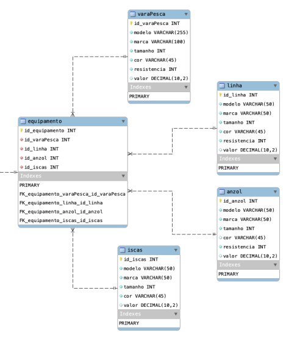
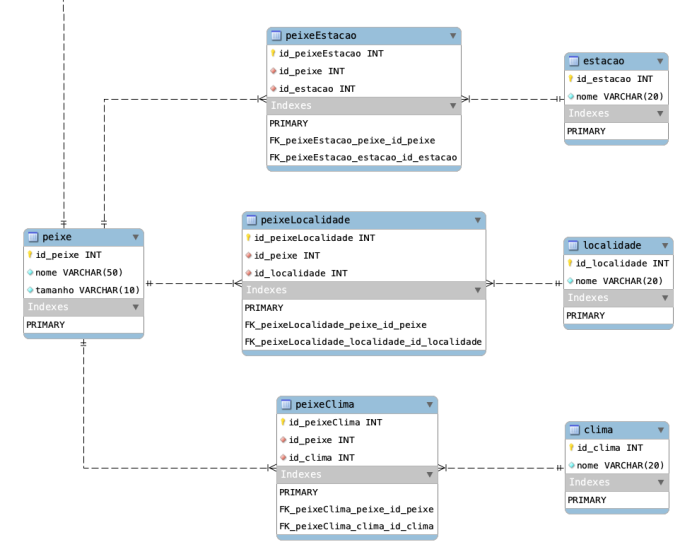
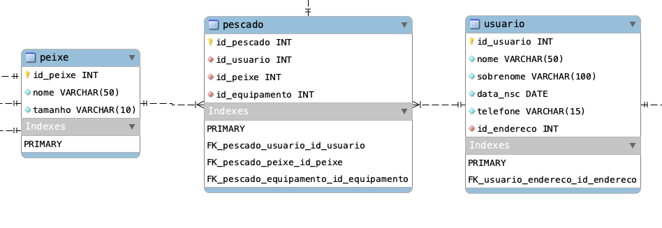

# Introdução

Esse é o Projeto final de **Banco de Dados I** do curso CTD da Digital House.

# Descrição do Projeto

Nosso projeto é um banco de dados que cadastra pescadores e detalhes de cada peixe pescado, com isso é possível criar um histórico de cada pescador e relacionando os detalhes é possível encontrar os melhores cenários para cada caso.

## Entidades Principais

### Usuário

Essas são as tabelas de cadastro de usuário.

### Equipamentos

Essas são as tabelas de cadastro de equipamentos, cada item é descrito com seus atributos como marca, modelo, cor, tamanho e etc.
O cadastro da tabela **Equipamentos** é relacionada é cada pesca, assim podemos ver os detalhes dos equipamentos utilizados em cada cenário.

### Peixes

Essas são as tabelas de cadastro de peixes. Cada peixe tem suas particularidades como seus tamanhos possíveis, regiões onde são comuns e climas em que são mais prováveis de serem encontrados.
Esse detalhes são importantes para um bom planejamento dos pescadores.

### Pescado

Por fim essa é a tabela de cadastro de pescado. Ela é onde todas as outras entidades se relacionam. Ela cadastra detalhes de cada peixe pescado.

# Autores

  
  
  
  
  

[easter egg](https://youtu.be/1kX9t-SZd38)
